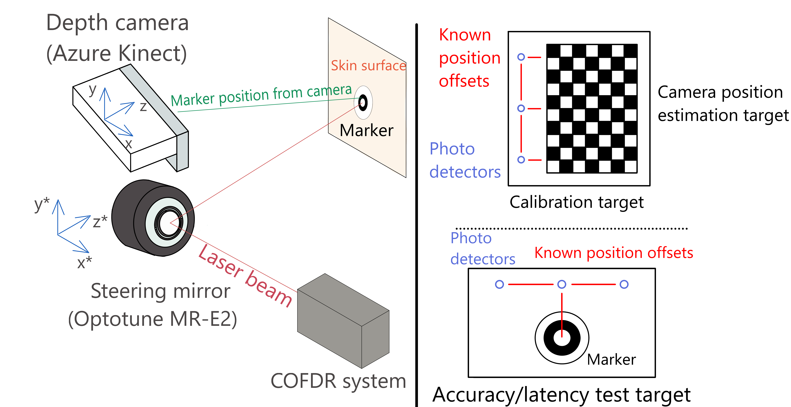

<h1>Galvo Tracker</h1>




<h2>Installation</h2>

1.1) To install dependencies run in root folder (run with Anaconda prompt):
```
conda create --name <env_name> 
conda activate <env_name>
conda install python=3.8
pip install opencv-python
pip install pyserial
pip install pykinect_azure
pip install matplotlib
pip install sympy
pip install scipy
pip install scikit-image
pip install python-usbtmc
pip install thorlabs-apt-protocol
pip install keyboard
cd optomdc_install_files
pip install optoKummenberg-0.15.3755-py3-none-any.whl
pip install optoMDC-1.1.3755-py3-none-any.whl
```

1.2) Install libusb-win32 with Zadig (url: https://zadig.akeo.ie/) to use USBTMC.

1.3) Install Azure Kinect SDK (url: https://github.com/microsoft/Azure-Kinect-Sensor-SDK/blob/develop/docs/usage.md)

1.4) To profile the python script use (optional)
python -m cProfile -s tottime script.py

1.5) WHYCON Python binding generation (Optional)

  To setup pybind:
    git clone https://github.com/pybind/pybind11.git


  To compile the circle detection module run in pywhycon folder(Opencv and CMake should be installed on the system):
  ```
  mkdir build
  cd build
  cmake ..
  make
  ```
    
  

  The module file is generated in build folder inside the Release or Debug directory based on the compile mode. (Example module file: circle_detector_module.cp38-win_amd64.pyd)

  - Circle detection library must have the same python version with the environment python version.
  - You must place opencv dll files next to circle detection module file.
  - You must give execution rigts to dll and module files in circle detection library, otherwise you get access denied error during load dll operation.


<h2>Scripts</h2>
2.1) 
All scripts can be run with command: 

```
python script_name.py
```

- calibrate.py : It is the main calibration program. Used together with chessboard calibration pattern on top of the calibration pattern. Sensor plate is used to detect the position of the laser. 
- calibrate_color.py : Calibration is done by placing a target plane in front of the direction mirror. Laser color is used to detect laser position.
- visualize_calibration_points.py : It displays the recorded calibration points in 3D.
- measure_calibration_error_with_target_plane.py : It measures the calibration error by scanning around the detector and finding its center location. Measurement is done by pressing "m" key. 
- point_laser_to_mouse_position.py : Test script to check depth camera and mirror controller integration. Color camera output is displayed and mouse is used to point the laser to specified point.
- pywhycon_track_target_with_laser.py : WHYCon marker is used to detect the target. Target position is extracted in §D and deflection mirror is used to point the laser to target position. It is the combination of all parts of the system.
- mirror_gui.py : Simple GUI program to control mirror. 3D coordinates are entered with sliders and laser is pointed to entered position. 
